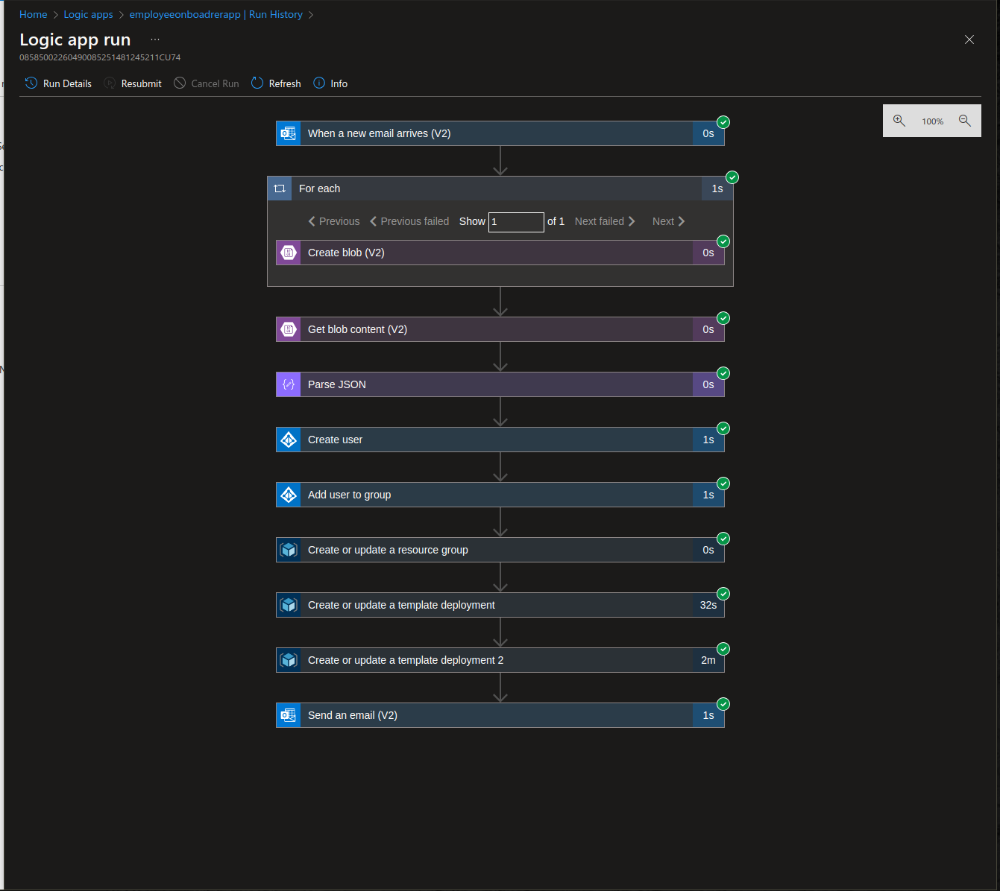

# Onbaord Automator
##### _Automate the booring and lengthy process of emboarding a new employee_

One of the immense benefits of the cloud is the ability to automate lengthy tasks. Here we proceed to use azure logic apps which is a low-code app development service to deploy an app that rapidly onboards an employee and provisions necessary resources in good time.

## Workflow

- The onboard_automator app is hosted in azure
- We use the convertjson.py to generate random employee details
- We use the sendemail_json.py to send the employee details as a json attachment to the mailbox of the IT admin 
- The mail once recieved in the IT admins mailbox triggers the onboard_automator app and kicstarts the onbaord process

[]

 
Here is a link explaining this workflow in detail: 